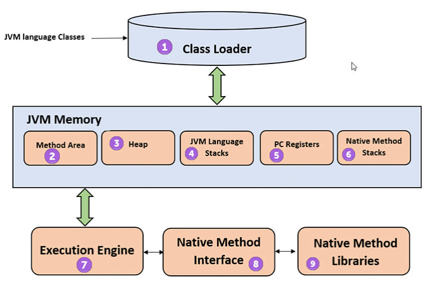

Kiến trúc JVM

# 1. Kiến trúc của JVM

## 1.1. Classloader

ClassLoader là một hệ thống con của JVM, được sử dụng để tải các class file từ các nguồn khác nhau: file hệ thống, mạng, csdl. Nó thực hiện ba chức năng chính: Loading, Linking và Initialization

- Loading: ClassLoader tìm và tải các lớp từ các nguồn vào bộ nhớ
- Linking: Sau khi các lớp được nạp, chúng được liên kết. Việc liên kết bao gồm kiểm tra bytecode và xác minh rằng lớp không chứa lỗi
- Initialization: Sau khi liên kết, lớp được khởi tạo, nghĩa là các khối static và các biến static được thiết lập

## 1.2. Heap

Heap là vùng bộ nhớ mà JVm cấp phát để chứa các đối tượng. Mỗi khi ta tạo 1 đối tượng mới, bộ nhớ heap là nơi mà đối tượng đó được lưu trữ. Bộ nhớ heap được chia thành 3 phần chính:

- Young generation: nơi lưu trữ đối tượng mới được tạo ra, được chia thành 3 khu vực nhỏ hơn:
  - Eden space: nơi các đối tượng mới được cấp phát
  - Survivor space 1 (S0) và survivor space 2 (S1): được sử dụng để lưu trữ các đối tượng sống sót từ các lần dọn rác trước đó
- Old generation: nơi các đối tượng tồn tại lâu dài thường được chuyển đến từ Young Generation sau nhiều lần dọn rác
- Permanent Generation: được sử dụng để lưu trữ các metadata của lớp, phương thức, và các thông tin liên quan đến cấu trúc chương trình
